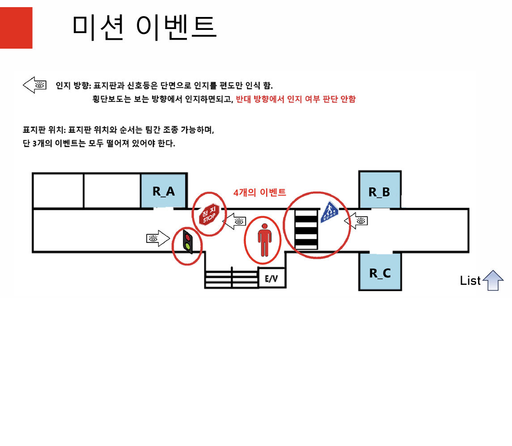
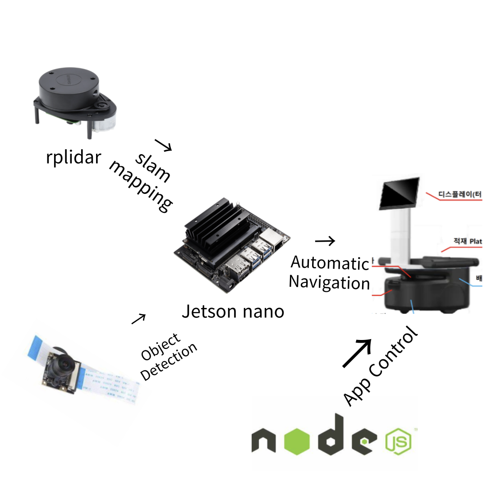
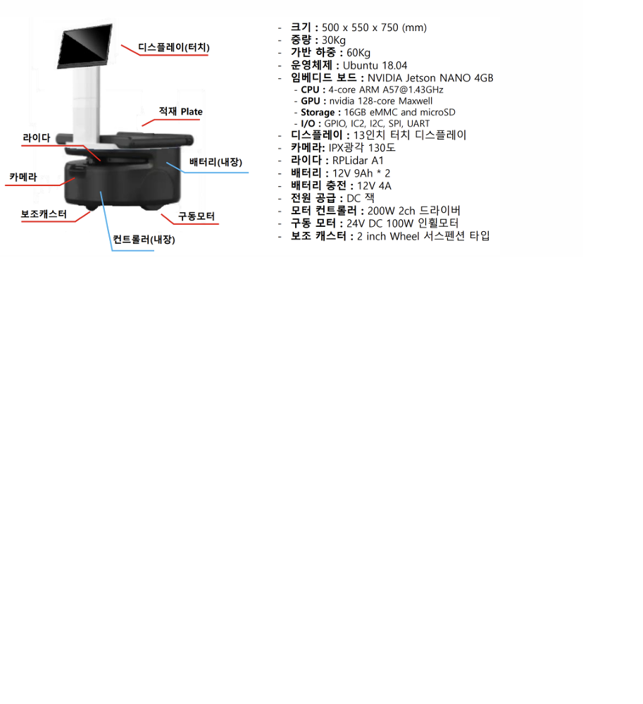
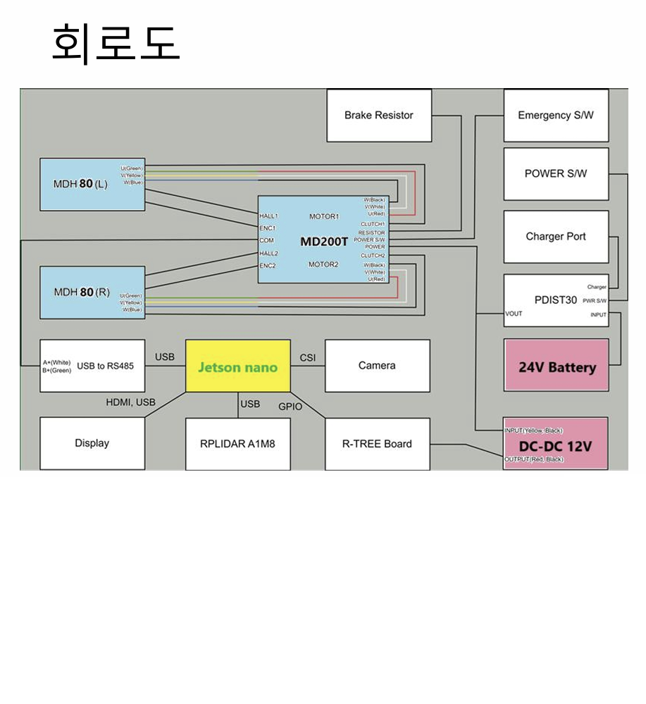
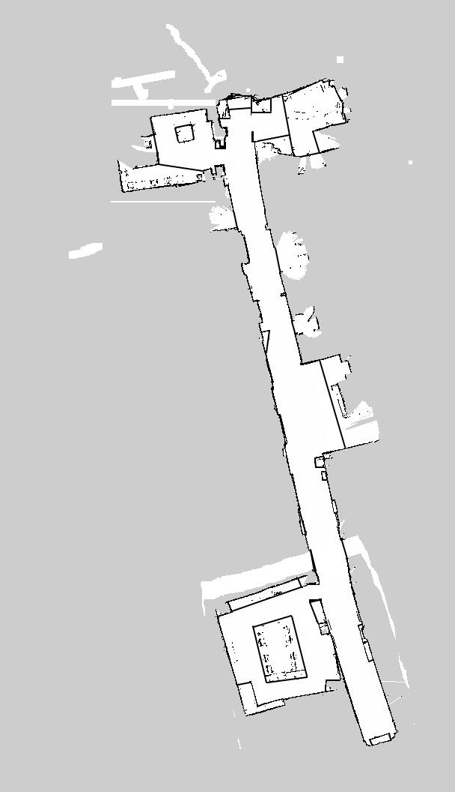

# 대구 AI 허브 _ 자율주행 프로젝트

# AI를 통한 자율주행 배달로봇


## 기술 스택

- Language

## 프로젝트 소개
> AI와 실시간 정보를 통한 이미지 처리, SLAM Mapping을 이용하여 배달 로봇 자율주행

## 목표

### 최종 목표



### 미션 시나리오


---


## Block Diagram



## 기간

- 2025 - 02 - 03 ~ 2025 - 02 - 28


## 배송로봇 사양

```
> 크기 : 500 x 550 x 750 (mm)
> 중량 : 30kg
> 가반 하중 : 60kg
> 운영체제 : ubuntu 18.04
> 임베디드 보드 : NVIDIA Jetson NANO 4GB
	CPU : 4-core ARM A57@1.43GHz
	GPU : nvidia 128-core maxwell
	I/O : GPIO, IC2, SPI, UART
> 디스플레이 : 13인치 터치 디스플레이
> 카메라 : IPX 광각 130도
> 배터리 : 12V 9Ah * 2
> 라이다 : RPLidar A1
> 전원 공급 : DC
> 모터 컨트롤러 : 200W 2ch 드라이버
> 구동 모터 : 24V DC 100W 인휠모터
> 보조 캐스터 : 2 inch Wheel 서스팬션 타입
```

## 조립도


## 회로도



```
전장 재료 리스트

- MD 200T
- PDIST30
- MDH80
- Jetson nano 4GB
- R-TREE board
- Jetson case
- USB hub
- Down converter
```

## SLAM Mapping



## 특징

- Deep Learning & OpenCV을 통한 이미지 Detection
- nodeJS를 통한 Web Server 구성
- 로봇 실제 조립을 통한 parameter의 심층 이해
- SLAM Mapping 을 통한 자율주행 
- torch, torchvision 을 사용 & AI를 활용, 약 2 만장의 이미지를 학습시켜 직접 Image Detection에 사용.
- rostopic 을 활용한 임베디드 통신


## 실제 구현 사진


