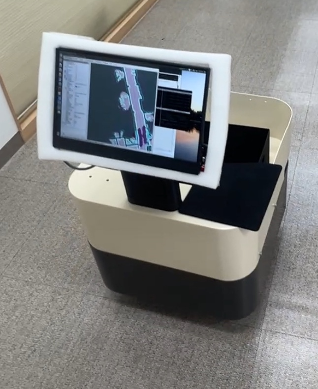

# 대구 AI 허브 _ 자율주행 프로젝트

# AI를 통한 자율주행 배달로봇

> 2025.02.03 - 2025.02.28

## 기술 스택

### AI Training framework
 

### Image Detection

### Robot Operation

### System Operation

### Web

## 특징

- Deep Learning & OpenCV을 통한 이미지 Detection
- nodeJS를 통한 Web Server 구성
- 로봇 실제 조립을 통한 parameter의 심층 이해
- SLAM Mapping 을 통한 자율주행 
- torch, torchvision 을 사용 & AI를 활용, 약 2 만장의 이미지를 학습시켜 직접 Image Detection에 사용.
- rostopic 을 활용한 임베디드 통신

  
## 프로젝트 소개
> AI와 실시간 정보를 통한 이미지 처리, SLAM Mapping을 이용하여 배달 로봇 자율주행

## 목표

### 최종 목표

### 미션 시나리오

---

## Block Diagram

## 배송로봇 사양

## 조립도

## 회로도

전장 재료 리스트
- MD 200T
- PDIST30
- MDH80
- Jetson nano 4GB
- R-TREE board
- Jetson case
- USB hub
- Down converter

## SLAM Mapping

